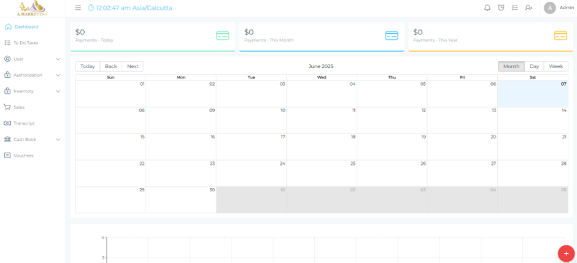
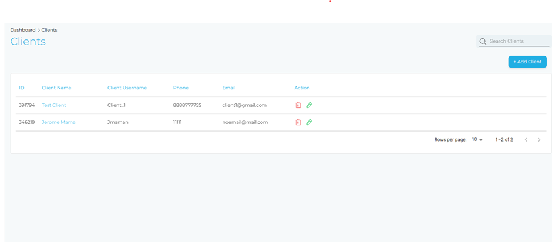
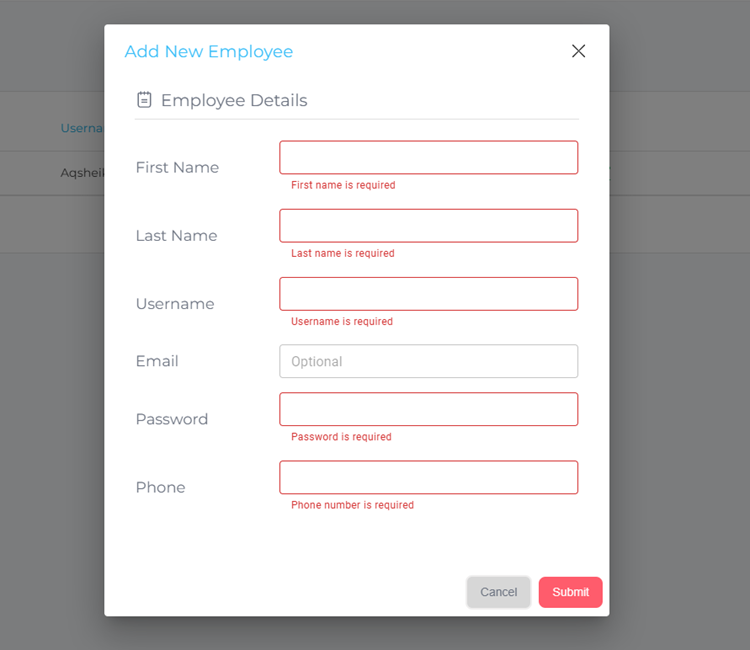
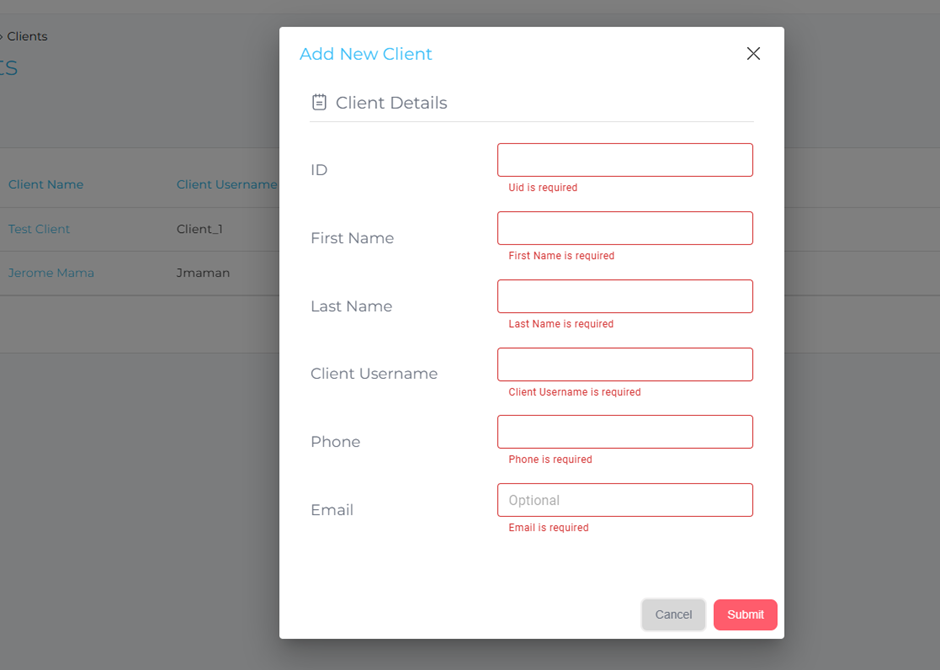
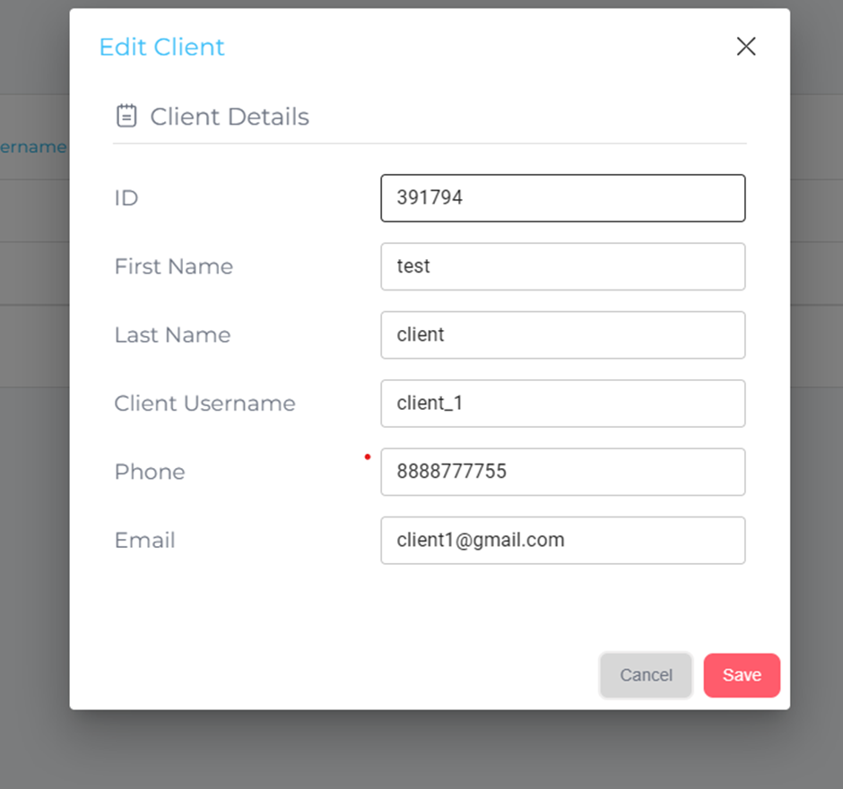

# Test

1. Display time zone on top bar.
2. When create new Employee, display form validation message(under each field) instead of alert if some fields are empty
3. Add client button and modal.
4. Add client edit feature.

## Required:
 Node.js 18+

# GrowCRM: Real Estate Agency Management System

GrowCRM is a comprehensive management system designed to streamline the processes of real estate agencies. It provides a centralized platform for managing various aspects of real estate operations, including lead management, analytics, project and inventory management, task management, notifications, role-based authentication, client and employee management, invoices and cashflow management, approvals management, and more.

## Key Features

- **Lead Management**: Efficiently capture, track, and manage leads throughout the sales pipeline.
- **Analytics**: Gain valuable insights into key performance metrics and trends with powerful analytics tools.
- **Project, Society, and Inventory Management**: Organize and manage projects, societies, and inventory listings with ease.
- **Task Management**: Assign tasks, track progress, and ensure timely completion of projects and assignments.
- **Notifications**: Stay informed with real-time notifications for important updates, reminders, and events.
- **Role-based Authentication**: Control access and permissions with role-based authentication and authorization.
- **Client Management**: Maintain detailed records of clients, including contact information, preferences, and interactions.
- **Employee Management**: Manage employee information, schedules, roles, and performance evaluations.
- **Invoices and Cashflow Management**: Generate invoices, track payments, and manage cashflow effectively.
- **Approvals Management**: Streamline approval processes for various transactions, contracts, and documents.
- **Other Features**: Additional features include document management, calendar integration, reporting tools, and events.

## Tech Stack

- **Frontend**:
  - React.js
  - Material UI
  - Tailwind CSS

- **Backend**:
  - Node.js
  - Express.js
  - MongoDB


## Installation and Setup

1. **Clone the Repository**: Use `git clone` to clone this repository to your local machine.
   ```bash
   git clone
   ```

2. Install Dependencies
There are two main directories inside this project: client for the frontend and server for the backend. You'll need to install dependencies for both.

a. Frontend (Client)

Navigate to the client directory:
   ```bash
   cd React-Node-Test/client
   ```
Install the required dependencies using npm:
   ```bash
   npm install --legacy-peer-deps
   ```
Start the frontend development server:
   ```bash
   npm run dev
   ```

b. Backend (Server)

Navigate to the server directory:
   ```bash
   cd React-Node-Test/server
   ```
Install the backend dependencies:
   ```bash
   npm install --legacy-peer-deps
   ```
Start the backend development server:
   ```bash
   npm run dev
   ```

3. Configure Environment Variables
In both the client and server directories, create a .env file in the root directory.
Define the necessary environment variables for both the frontend and backend. Samples can be found in .env.example file

4. **Start the Development Server**:
   - After installing dependencies and configuring environment variables, start the development server:
     ```bash
     npm start
     ```
   - The application will be accessible at `http://localhost:3000` in your web browser.

## Usage

1. **Login and Authentication**:
   - Use the provided login credentials or create a new account to access the system.
   - Authenticate users based on their roles and permissions.

2. **Lead Management**:
   - Capture and manage leads through the sales pipeline.
   - Track lead status, interactions, and conversion metrics.

3. **Project and Inventory Management**:
   - Organize and manage projects, societies, and inventory listings.
   - Maintain detailed records of properties, units, and amenities.

4. **Task Management**:
   - Assign tasks, set deadlines, and track progress.
   - Collaborate with team members and allocate resources efficiently.

5. **Invoices and Cashflow Management**:
   - Generate invoices, track payments, and manage cashflow.
   - Monitor revenue, expenses, and financial performance.

6. **Notifications and Alerts**:
   - Receive real-time notifications for important updates, reminders, and events.
   - Stay informed and proactive in managing tasks and deadlines.

7. **Reports and Analytics**:
   - Generate reports and analyze key performance metrics.
   - Gain insights into sales performance, customer behavior, and market trends.

---


	Display time zone on top bar.

 
Add client button and modal.


 

When create new Employee, display form validation message(under each field) instead of alert if some fields are empty for both employee and client



 
 
Edit client

 

<video controls src="2025-06-07 00-13-54.mkv" title="Title"></video>